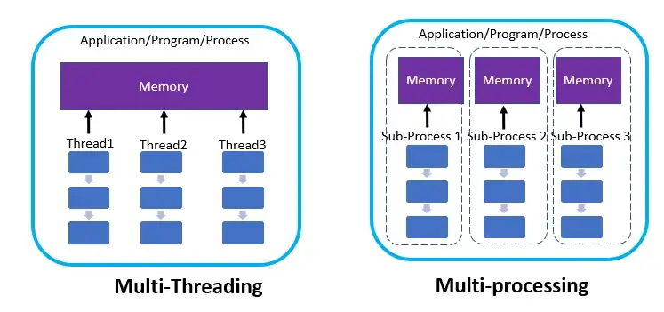

# Concorrência e Paralelismo

Paralelismo é quando várias tarefas estão sendo executadas ao mesmo tempo. 
É o objetivo final dos programas concorrentes. A concorrência é inferior 
ao paralelismo, significa que várias tarefas serão iniciadas no mesmo período 
de tempo. No entanto, em qualquer momento específico, estamos fazendo apenas 
uma de cada vez.

Aplicados à culinária, esses seriam exemplos de concorrência e paralelismo.

A concorrência tem apenas uma pessoa na cozinha:

  * Comece cortando cebola
  * Comece a aquecer a panela
  * Termine de cortar as cebolas
  
Nesse caso, fica claro que não se pode fazer várias coisas AO MESMO TEMPO.
Há várias tarefas ocorrento simultaneamente, mas a cada instante o cozinheiro
está dando atenção a apenas uma delas.

O paralelismo tem várias pessoas na cozinha:

  * Pessoa 1 está cortando cebolas
  * Pessoa 2 está cortando pimentas vermelhas
  * A pessoa 3 espera que a panela aqueça

Neste caso, várias tarefas estão sendo executadas ao mesmo tempo e cada pessoa
cuida de uma delas de forma independente.

Ao pensar sobre concorrência ou paralelismo, às vezes é importante entender qual
tipo de problema está sendo resolvido que em geral pode ser separado em uma de 
2 classes a seguir:

  * **Paralelismo de dados**: um exemplo típico seria a soma dos elementos de 
                              uma linha de uma matriz. A soma de cada linha é 
                              independente das outras linhas e pode ser 
                              realizada por um processo independente.

  * **Paralelismo de tarefas**: por exemplo uma tarefa seria calcular o valor
                               médio dos elementos da matriz e a outra tarefa
                               a variância.

É importante ressaltar que em toda programação concorrente os dados/tarefas são
distribuídos para computação e em algum momento no futuro deverá ocorrer a 
coleta dos resultados dessa operação. Essa idéia de distribuir e agregar acabou 
gerando um modelo de programação conhecido por Map/Reduce em BigData.

## Sistema operacional

O paralelismo real demanda múltiplos processadores, maquinas, etc. Assim, o 
parelelismo real demanda um hardware específico ou arquitetura específica.

Nos sistemas operacionais modernos "multitarefa-preemptivos", cabe ao 
escalonador do sistema operacional decidir quais tarefas serão executadas e ele 
a cada instante fica fazendo o chavemento entre as tarefas. com advento dos 
múltiplos núcleos, sub-processos de uma determinada aplicação podem de fato 
serem executados de forma "quasi-paralela".

## O processo

Um processo é a abstração que o sistema operacional usa para executar o código. 
O código da aplicação é alocado a um processo ao qual são atribuídos memória e 
outros recursos compartilhados. A abstração do processo permite que o sistema 
operacional “distinga” entre os programas em execução, para que eles não criem 
conflitos entre si. Por exemplo, o Processo 1 não pode acessar a memória 
reservada pelo Processo 2. 

# Implementado a concorrência

Como a concorrência (ou mesmo o paralelismo) é realmente alcançada nos sistemas
operacionais modernos? Do ponto de vista do desenvolvedor, através dos 
seguintes mecanismos: 

  * assíncronismo.
  * multithreading.
  * multiprocessamento.

## IO Bound versus CPU bound

Operações vinculadas à CPU requerem ciclos de CPU. As operações da CPU podem 
incluir a execução de operações matemáticas, manipulação de texto, processamento
de imagem e assim por diante. Neste tipo de operação a carga da CPU em geral 
aumenta. neste caso tem-se uma operação 'CPU bounded'

Por outro lado, se a aplicação tem por objetivo obter dados de uma fonte 
externa. Essa fonte podendo ser um banco de dados em execução em outro servidor,
um serviço da Web ou até mesmo um arquivo que reside em um sistema de arquivos 
compartilhado ou até mesmo em uma fila de tarefas distribuídas. 
Estes são exemplos de operações vinculadas a IO e portanto 'IO bounded'

Em geral, operações 'CPU bounded' são melhor executadas com multiprocessamento,
já 'IO bounded' com threads ou assíncronismo.

## Multithreading

Threads são fluxos de execução simultâneos dentro do mesmo processo . O processo
inicia vários threads de execução, que “evoluem” de forma independente em 
função do que têm de fazer.

Se um programa deve baixar dados de três sites e depois combiná-los para um 
relatório final, em uma programção sequencial cada ação acima será realizada 
uma após a outra. Já num ambiente 'multithread' cada ação é realizada de 
forma 'independente' e o resultado combinado no futuro. 

### Compatilhamento de recursos

As threads existem dentro de um mesmo processo criado por uma aplicação. Isso 
significa que elas compartilham os mesmos dados do processo. Elas podem 
ler e modificar variáveis ​​locais e acessar a mesma memória ou os mesmos recursos
(arquivos, soquetes de rede, etc).

Isso pode causar alguns problemas, especialmente mutações inesperadas de dados 
compartilhados. Para evitar isso, muitas vezes são necessários mecanismos de
sincronização.

### A "maldição" do GIL (Global Interpreter Lock)

O gerenciador de memória Python não é thread-safe. Como resultado, multiplas
threads podem atualizar o mesmo objeto na memória. Isso pode acabar corrompendo
o estado dos objetos em um aplicativo.

Os dados devem ser protegidos usando mecanismos de bloqueio para que as várias 
threads em execução não corrompam a memória. Para resolver esse problema, o 
interpretador Python usa um bloqueio, conhecido como Global Interpreter Lock 
(GIL). Cada processo em python possui seu próprio GIL. O GIL garante que apenas 
uma thread possa executar o interpretador em uma determinada instância de tempo.
Todas as outras threads ficam no estado de espera até que o GIL seja liberado. 
Cada thread tem cerca de 5ms de tempo de execução e o interpretador libera o 
bloqueio para a thread para que ela possa ser executada.

O GIL não exlui o uso de mecanismos de sincronização, uma vez que ele só 
funciona para objetos internos do python, o que exclui variáveis de aplicação.

## Assíncronismo

O Python oferece recursos de assincronismo ou cooperação permitindo executar
outras ações enquanto uma tarefa está em um estado de espera de E/S. A 
biblioteca *asyncio* permite que os codificadores Python escrevam código 
simultâneo usando a sintaxe *async/await* enquanto têm controle total sobre a 
execução das corrotinas simultâneas. Cabe ressaltar que há outros 'frameworks'
além do *asyncio*.

A base do Async IO está no objeto de loop de eventos. Podemos pensar no loop de 
eventos como uma pilha de funções. O loop de eventos é essencialmente o núcleo 
de toda operação assíncrona. Ele mantém as funções que serão executadas e 
garante que as funções não se bloqueiem.

A diretiva *async* indica que uma ação será completada no futuro e a diretiva 
*await* aguarda o resultado de uma ação.

Assíncronismo, em geral, é preferível ao uso de threads e é melhor empregado em 
operações 'IO bounded'. Todas as operações realizadas no modo *async* ocorrem
na 'Main Thread' e portanto não existe preocupação compartilhamento de recursos.
Por outro lado, requer a adoção de um **"tipo de paradigma" de programação** 
específico.

## Multiprocessmento

Python tem uma poderosa biblioteca de multiprocessamento. Isso permite que 
uma aplicação crie diferentes processos para manipular dados que fazem
uso intensivo de CPU. Os processos em Python não estão vinculados ao GIL. 
Portanto, nada impede que o paradigma de programação assíncrona seja usada na 
elaboração do código que os processos irão utilizar.

Além disso, os processos não compartilham o contexto de memória e, portanto, 
não é mais fácil corromper os objetos de memória.

Há 3 formas de se criar processos:

  * Fork - inicializa um processo copiando a área de memória atual. A ser 
           evitado se o processo pai usa threads.
  * Spawn - inicializa um processo totalmente novo.
  * ForkServer - inicializa um servidor do qual novos processos herdam a área de
                 memória.

### Compatilhamento de recurso

Diferentemente das threads, compartilhar dados entre processos é algo um pouco 
mais complexo, podendo ser realizado por meio de filas, gerenciadores de 
contexto e pipes.

É importante notar que um modelo do tipo produtor-consumidor pode ser necessário
ao acessar um recurso comum. Por exemplo, escrever no mesmo arquivo.

## Produtores, consumidores e filas

Problemas de sincronização podem ser resolvidos apenas mudando o paradigma.

*A melhor maneira de evitar problemas de sincronização é evitar completamente a 
sincronização.*

Isso é obtido usando o padrão Produtor-Consumidor. As unidades produtoras, 
em geral a aplicação ou alguns de seus nós concorrentes, criam 
“tarefas pendentes” para executar e, em seguida, as colocam em uma fila 
compartilhada. Os nós consumidores ou workers removerão as tarefas da fila e 
a executarão.

